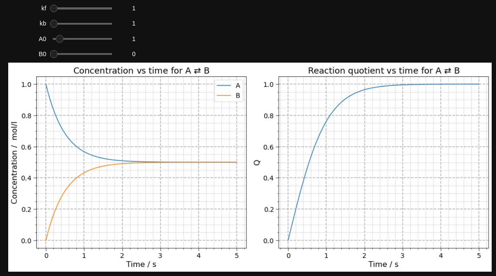

# Reversible reactions of the first order



Interactive web app:

<p align="center">
<a href="https://reversiblefirstorder.streamlitapp.com/" target="_blank">
</a>
</p>

A simple project to plot Concentration vs Time or Reaction quotient vs Time plots for reversible first order reactions. Interactive plots can also be made following [tutorial](tutorial.ipynb) instructions. An interactive Colab notebook can also be used <a href="https://colab.research.google.com/github/chicolucio/ReversibleFirstOrder/blob/main/colab/interactive_colab.ipynb" target="_blank">
  
</a>

 # Installation and usage

1. clone the repo
2. create a virtual environment
3. activate the virtual environment
4. install dependencies with [`requirements.txt`](requirements.txt)
5. use the code and/or run a local Streamlit app

```bash
git clone git@github.com:chicolucio/ReversibleFirstOrder.git
cd ReversibleFirstOrder
python -m venv .venv
source .venv/bin/activate
pip install -r requirements.txt
streamlit run Home.py
```

These are the Python packages under the hood:


See the [tutorial](tutorial.ipynb) <a href="https://colab.research.google.com/github/chicolucio/ReversibleFirstOrder/blob/main/colab/tutorial_colab.ipynb" target="_blank">
  
</a>
to know how to customize the plot and how to animate it like the gif at the top
of this readme.

Interactive web app hosted on Streamlit Cloud:

<p align="center">
<a href="https://reversiblefirstorder.streamlitapp.com/" target="_blank">
</a>
</p>

# Contributing

All contributions are welcome.

**Issues**

Feel free to submit issues regarding:

- recommendations
- more examples for the tutorial
- enhancement requests and new useful features
- code bugs

**Pull requests**

- before starting to work on your pull request, please submit an issue first
- fork the repo
- clone the project to your own machine
- commit changes to your own branch
- push your work back up to your fork
- submit a pull request so that your changes can be reviewed

# License

MIT, see [LICENSE](LICENSE)

# Citing

If you use this project in a scientific publication or in classes, please consider citing as

F. L. S. Bustamante, Reversible reactions of the first order, 2020 - Available at: https://github.com/chicolucio/ReversibleFirstOrder
